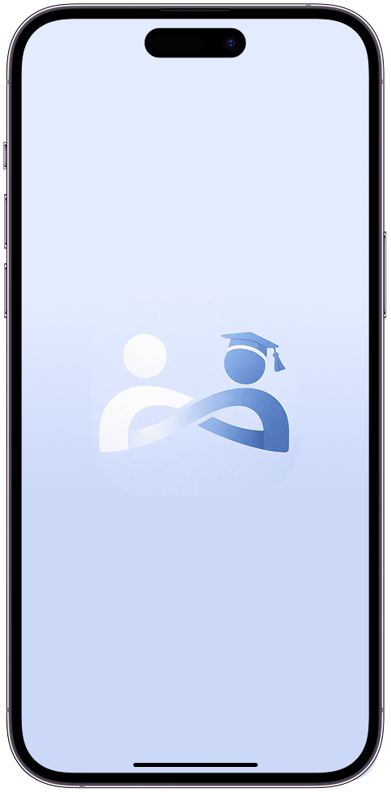
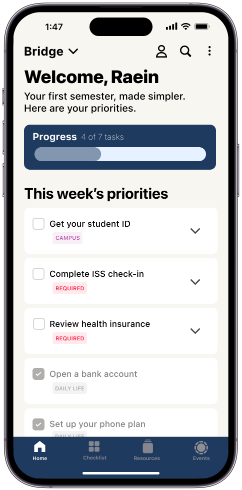
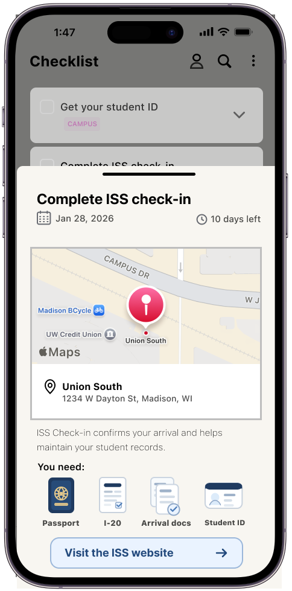
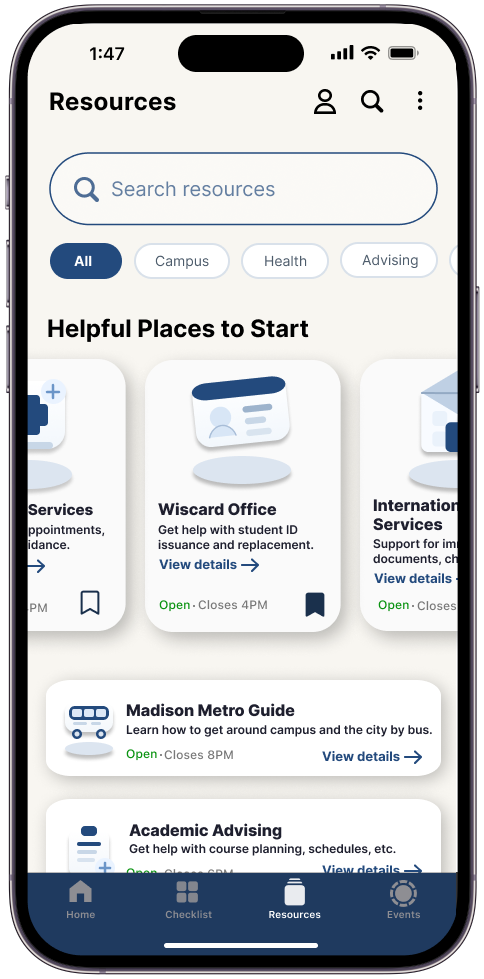
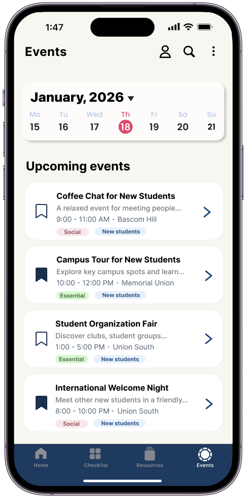
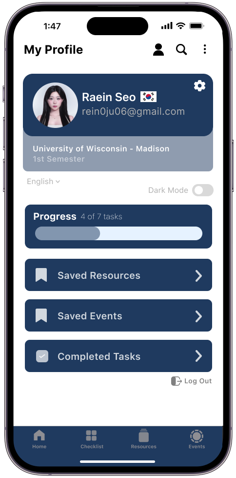

## 『Bridge』 _A better onboarding app for international students_ 

  

Built by <strong>Raein Seo</strong>

  
📩 rein0ju06@gmail.com

  

🔗 <a href="https://www.linkedin.com/in/raein-seo" target="_blank"><b>LinkedIn</b></a> / 
<a href="https://instagram.com/rein_seo" target="_blank"><b>Instagram</b></a> / <a href="https://www.figma.com/design/ysMQywgZViL0WCJuzV10FX/Bridge?node-id=1-3&t=GtWJwV3QS6s4SKuP-1" target="_blank"><b>Figma</b></a>

   

       
   

### Bridge simplifies the onboarding experience for international students in the U.S.
## Case Study

→ [View Full UX Case Study](case-study.md)
## Bridge

       

       

       

       

       

       

