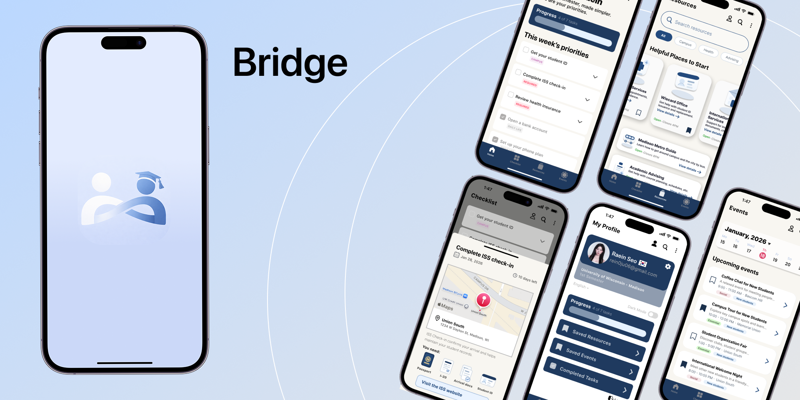

## 『Bridge』 _A better onboarding app for international students_ 

  

Built by <strong>Raein Seo</strong>

  
📩 rein0ju06@gmail.com

  

🔗 <a href="https://www.linkedin.com/in/raein-seo" target="_blank"><b>LinkedIn</b></a> / 
<a href="https://instagram.com/rein_seo" target="_blank"><b>Instagram</b></a>

   

       
   

## ┃Overview
Bridge helps international students navigate their first semester in the U.S. by organizing essential steps into a clear, simple flow.

## ┃Problem
International students often struggle with:
- Setting up bank accounts
- Understanding visa requirements
- Navigating campus systems
- Knowing what to do first

There is no single place that organizes this process clearly.

## 💡 Solution
Bridge provides:
- Step-by-step onboarding flow
- Personalized checklist
- Clear guidance for essential tasks
- A simple, intuitive interface

## ┃ Features
- 📋 Onboarding checklist  
- 🧭 Step-by-step guidance  
- 📍 Campus-specific info  
- 🔔 Reminders & progress tracking  

## ┃ Screens
- Home screen  
- Checklist flow  
- Progress tracker  

## ┃ Tech Stack
- Figma (UI/UX Design)
- HTML / CSS (Landing page)
- React (예정)
- Firebase (예정)

## ┃ What I Focused On
- Reducing confusion for first-time users  
- Clear and minimal UX  
- Making onboarding feel simple  
